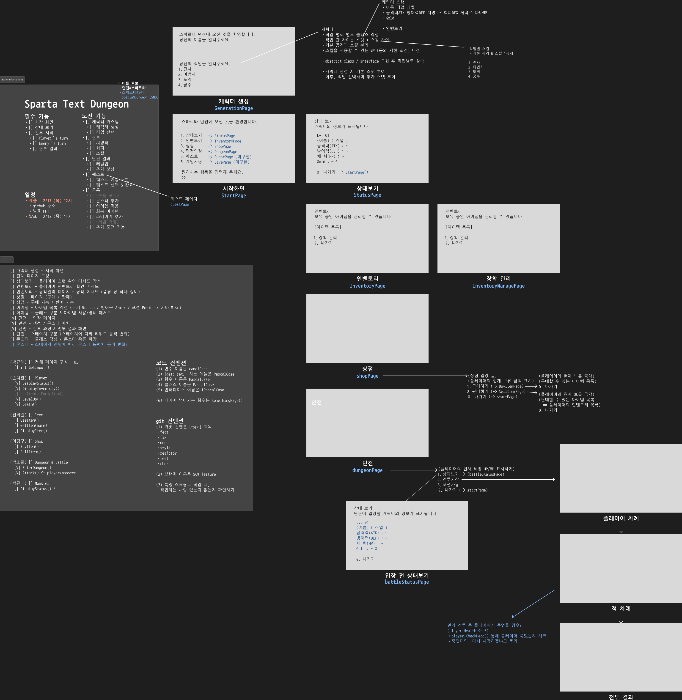
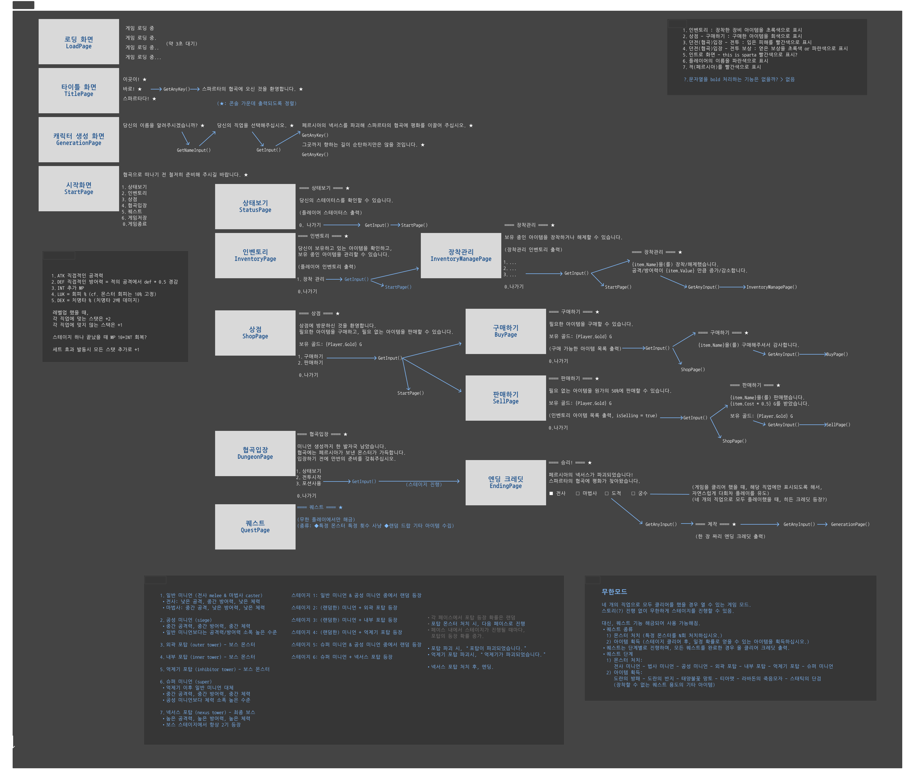

 
# 📘 SprataNDungeon - TEXT RPG
 

---

## 📌 프로젝트 개요

- **프로젝트**: SpartaNDungeon
- **개발환경**: C#
- **개발기간**: 25.02.06 ~ 25.02.13
- **개발인원**: CS25조 5명 (손치완, 박규태, 진희원, 박소희, 이정구)
- **타임라인**:  
  🔹 25.02.06 (목) 와이어프레임 작성 및 역할 분담  
  🔹 25.02.07 (금) 1차 병합 및 UI 구성  
  🔹 25.02.10 (월) 게임 컨셉 구성 및 수정  
  🔹 25.02.12 (수) 2차 병합  
  🔹 25.02.13 (목) main 분기 병합  
  🔹 25.02.13 (목) 최종 완성 및 프로젝트 발표  
- **주요기능**:  
  내용 출력, 캐릭터 스탯 확인, 인벤토리 확인, 장비 아이템 장착/해제, 아이템 구매/판매, 레벨 스케일링, 랜덤 몬스터 생성, 턴제 전투 진행, 소비 아이템 소모, 스킬 사용, 회피율/치명타 계산, 랜덤 리워드 제공, 몬스터 종류 확인, 게임 저장 및 불러오기, 퀘스트 표시, 퀘스트 진행 등
  

---

## 🧑‍🤝‍🧑 팀원 소개 및 역할 분담
CS 먹으러 간 거 아닙니다! C Sharp하러 온 겁니다! 물론 프로젝트 안에서는 CS를 먹게 되겠네요. (웃음)

| 이름 | 역할 | 상세 내용 |
|------|------|-----------|
| 손치완 | 게임 구성 및 기획   플레이어 기능 제작   전체 UI 조정   게임 저장/불러오기 기능 제작   퀘스트 기능 제작 | - 게임 전체 구성 및 컨셉 기획.   - 플레이어 스탯/인벤토리 표시.   - 플레이어의 죽음 확인.   - 플레이어 레벨업 확인 및 스탯 갱신.   - 전체 UI 페이지 제작 및 각 페이지 기능 구현.   - 인벤토리/아이템 표시 형식 변경.   - 플레이어 데이터/아이템 리스트/퀘스트 리스트 저장 및 불러오기.   - 퀘스트 목록 불러오기.   - 퀘스트 선택 및 완료.   - 퀘스트 완료 조건 확인. |
| 박규태 | UI 페이지 제작   몬스터 목록 및 기능 제작 | - 전체적인 UI 페이지 구성.   - 유저의 입력을 받아 프로그램에 전달.   - 콘솔에서 표시되는 글자색 변경.   - 던전에서 랜덤 몬스터 등장.   - 플레이어 레벨에 따른 몬스터 스탯 변화.   - 던전 스테이지에 따른 몬스터 리스트 변경.   - 네임드 몬스터 등장.   - 몬스터 위키 구성. |
| 박소희 | 던전 기능 제작   전투 및 스테이지 기능 제작 | - 던전 페이지 구성.   - 포션 사용 기능.   - 공격할 몬스터 선택.   - 공격 방식 선택.   - 몬스터/플레이어의 공격.   - 플레이어 스탯에 따른 회피 및 치명타율 계산.   - 전투 결과 확인 페이지 구성.   - 전투 종료 후 랜던 보상 지급. |
| 진희원 | 아이템 목록 및 기능 제작   타이틀 페이지 구성 | - 아이템 목록 작성.   - 아이템 장비 및 해제.   - 장비한 아이템 구분 표시.   - 세트 아이템 효과 구현.   - 회복 아이템 사용.   - 타이틀 페이지 디자인. |
| 이정구 | 상점 기능 제작   퀘스트 기능 제작   프로젝트 발표 | - 상점 구매하기 페이지 구성.   - 아이템 구매 및 판매.   - 장비 아이템의 중복 구매 제한.   - 퀘스트 기능.   - 발표 자료 제작.   - 프로젝트 발표 |

---

## 🎮 게임 설명
SpartaNDungeon 프로젝트를 통해 제작한 게임 **스파르타의 협곡(SpartaN Rift)**은 C# 콘솔 창으로 진행하는 텍스트 RPG입니다.  
플레이어는 페르시아의 위협으로부터 스파르타의 협곡을 지키기 위해 전장으로 떠나, 몬스터와 엘리트, 보스 몬스터를 처치해 게임을 클리어할 수 있습니다.  

**🕹️플레이 방법**  
1. **캐릭터 생성**: 캐릭터의 이름을 입력하고 직업을 선택해 캐릭터를 생성합니다.
2. **아이템 구매**: 상점에 방문해 새로운 장비나 포션 등 필요한 아이템을 구매할 수 있습니다.
3. **아이템 장비**: 인벤토리를 확인해 구매하거나 획득한 장비 아이템을 장착할 수 있습니다. 세트 효과가 있는 장비들도 있습니다.
4. **협곡 입장**: 협곡에 입장해 전투를 준비할 수 있습니다. 그 전에 캐릭터의 상태를 확인하거나 포션을 사용해 체력을 회복할 수 있습니다.
5. **전투**: 랜덤으로 등장하는 몬스터에게 일반 공격과 스킬 중 선택된 방식으로 공격합니다. 몬스터의 턴에서는 공격을 받을 수도 있습니다.
6. **전투 결과**: 스테이지에 등장하는 모든 몬스터를 처치하거나, 몬스터의 공격으로 플레이어의 체력이 0이 되면 전투가 끝이 나게 됩니다.

---

## 📖 와이어프레임
#### **1차 와이어프레임**
  
#### **2차 와이어프레임**

---

## 🚀 트러블슈팅 (문제해결)
#### 1️⃣ **클래스 기능을 통한 오브젝트 내용 변경**
- 문제: 반복적으로 생성해야 하는 다른 클래스의 오브젝트에 `Player` 오브젝트가 참조되어 있을 때, 계속해서 `null` 참조 오류가 발생했다.
- 해결: 특정 클래스의 오브젝트를 생성할 때, 생성자에 `Player` 오브젝트를 참조하는 것이 아니라, 해당 클래스 오브젝트의 고유 프로퍼티 값을 변화할 수요가 생겼을 때 이를 변화시킬 기능(메서드)를 추가하여 `Player` 오브젝트를 참조하게 하는 것으로 오류를 우회할 수 있었다.  
#### 2️⃣ **`static` 변수의 활용**
- 문제: `Player` 오브젝트의 프로퍼티를 불러올 때마다 오브젝트를 참조하고 불러오는 것이 매우 비효율적이었다.
- 해결: `Player` 클래스 내에서 필요한 변수 (예: `player.Gold` 등)를 정적 변수로 선언함으로써, 모든 클래스에서 쉽게 참조할 수 있도록 변경해 해결했다.  
#### 3️⃣ **`json` 직렬화와 역직렬화**
- 문제: 데이터 저장 후 불러오기를 했을 때, `player.inventory` 목록이 깨지는 현상이 발생했다.
- 원인: 특정한 클래스의 인스턴스에 대한 데이터를 저장할 때, `static` 변수 등은 json 문자열로 직렬화되지 않는다. 또한, 해당 클래스 내에서 불러와 사용할 수 있도록 선언되어 있지 않으면(예: `{get; set;}`으로 선언되어 있지 않으면), 역시 직렬화되지 않는다.
- 해결: 저장을 위해 `GameData`라는 새로운 클래스를 생성하고, 저장해야 하는 클래스와 해당 클래스의 `static`으로 저장된 변수, 다른 클래스에서 가져와야 하는 목록 등을 `GameData`에 불러오는 것으로 해결했다. 이후 직렬화를 통해 json 문자열로 변환해 저장하고, 불러오기에 사용했다.
#### 4️⃣ **콘솔에서의 표 형식**
- 문제: 아이템 혹은 인벤토리의 목록을 표시하는 화면에서 탭이 일정하게 적용되지 않아, 화면이 필요 이상으로 복잡하게 보이는 문제가 있었다.
- 원인: 아이템 및 인벤토리 각 항목의 문자열로 이루어진 프로퍼티들이 서로 다른 길이를 가지고 있기 때문이다. 또한, 시스템 상에서는 한글과 알파벳을 똑같이 길이 1의 문자로 취급하기 때문에 표시되는 길이가 달라지기 때문이다.
- 해결: 한글일 때와 알파벳 및 숫자를 서로 다른 길이로 계산하는 함수 `CalculateMixedString()`와, 서로 같은 크기의 칸 안에 출력되어야 하는 문자열 프로퍼티들을 리스트로 받아 한 칸의 길이를 결정하는 함수 `CalculateMaxNumber()`, 이 칸에 맞게 문자열을 출력하는 함수 `WriteSpace()`를 작성해 해결했다.
#### 5️⃣ **오브젝트 복제**
- 문제: 던전 스테이지에서 랜덤한 몬스터를 생성했을 때, 같은 이름의 몬스터들이 서로의 스탯(체력, 공격력, 사망 상태 등)을 공유하는 문제가 발생했다.
- 원인: 객체로 생성된 몬스터는 참조형 변수를 스탯으로 가지고 있어, 다른 곳에서 참조한 후 스탯을 변경할 경우 같은 종류의 객체들이 모두 
- 해결: 던전에서 랜덤한 몬스터의 객체가 생성될 때, `Monster` 타입으로 반환하는 클로닝 메서드를 만드러 개별적으로 독립적인 새로 객체를 생성함으로써 해결했다.
#### 6️⃣ **윈도우 버전 별 콘솔 제어**
- 문제: `Console.Clear()`를 했음에도 콘솔 위쪽에 남아 있던 내용이 사라지지 않고 남는 문제가 발생했다.
- 원인: 윈도우 10과 윈도우 11에 따라서 콘솔이 작동되는 방식에 차이가 있어 발생하는 것으로 추정되었다.
- 해결: 콘솔을 직접적으로 제어하는 명령어, `Console.WriteLine("\x1b[3J");`를 추가해 해결했다.

---

## ⏯️ 게임 시연 영상

